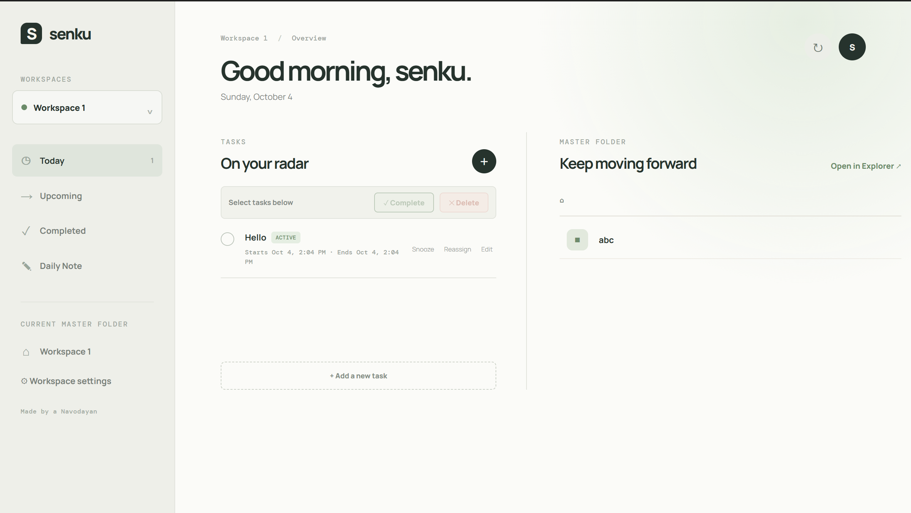
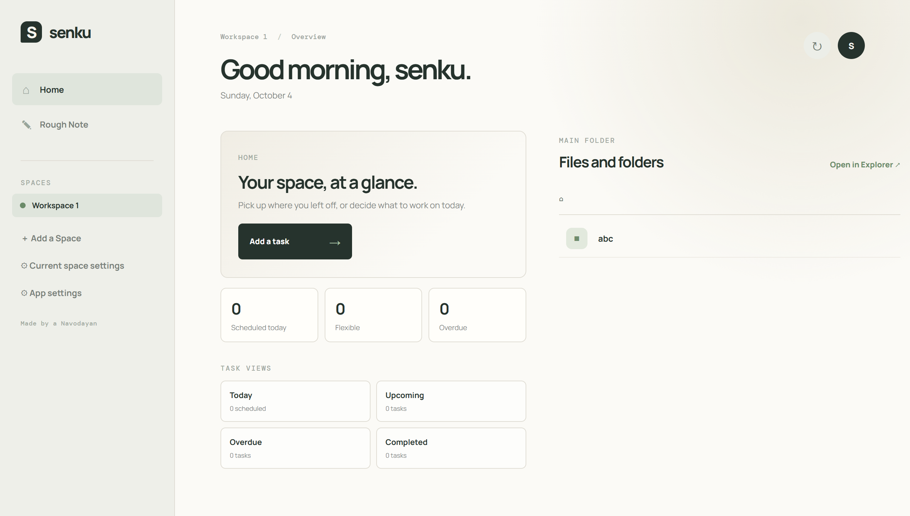

# Senku — Evolution

Senku is an ongoing project built through personal use, experimentation, and iteration.

The versions shown here represent how the workflow changed through actual usage rather than a single one-time design.

---

## v2.0.0 → v2.2.0

**v2.0.0** was a complete redesign of Senku.

Since then, the application has gone through smaller iterations in v2.1.0 and v2.2.0, refining the workflow based on continued use.

The result is the current **v2.2.0** release.

---

## Home

### v2.0.0

### v2.2.0

The Home experience evolved to make the current Space, task state, and important entry points easier to understand at a glance.

---

## Task System

### v2.0.0

### v2.2.0

The task workflow was refined around different types of work, including Scheduled and Flexible tasks, along with clearer handling of unfinished work.

---

## Spaces

### v2.0.0

### v2.2.0

Spaces became the main boundary for Senku's workflow, keeping folders, tasks, notes, and resource-opening preferences together.

---

## What Changed

Some of the major changes between the earlier design and v2.2.0 include:

- Refined Space-based organization
- Scheduled and Flexible task types
- Improved task state handling
- Improved resource linking
- Optional automatic resource opening
- Improved file browsing
- More explicit Overdue and Error handling
- Continued UI and workflow refinement

---

## Why the Changes?

Senku was not designed entirely in isolation.

It was used repeatedly, and the workflow was changed when something felt unnecessary, confusing, or inefficient.

The goal was not to add as many features as possible.

The goal was to make the path from:

**“I need to do this.”**

to

**“I'm doing it.”**

as short as possible.

---

## Current Version

**Senku v2.2.0**

This is the current public release.

Senku is still under active development, so the workflow will continue to evolve as it is used.

---