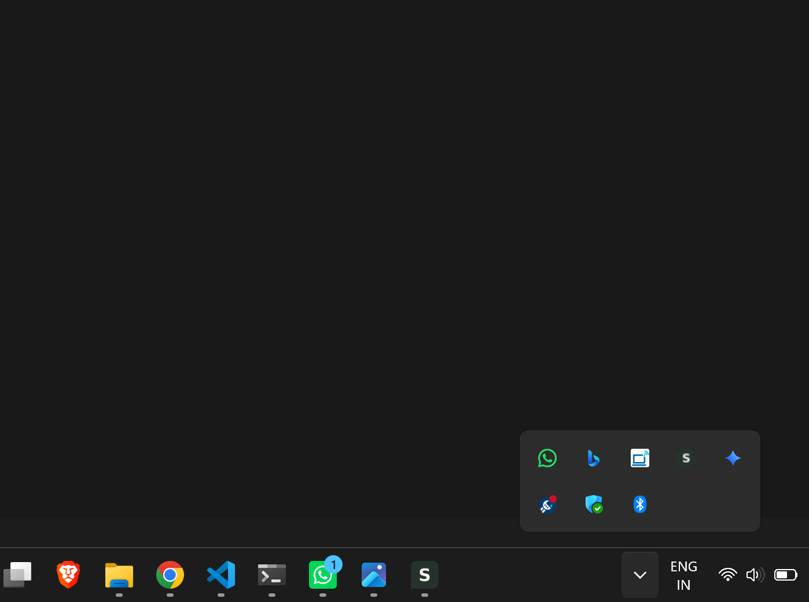

# Senku — Setup

Senku is currently distributed as a Windows desktop application.

## Download

Go to the latest GitHub Release:

**[Download Senku](../../releases/latest)**

Download the latest:

```text
Senku-2.2.0.exe
```

No Node.js, npm, or development environment is required to use the released application.

---

## Installation

Senku is currently distributed as a portable Windows executable.

1. Download the `.exe` from the latest release.
2. Place it somewhere convenient on your computer.
3. Run the executable.
4. Create your first Space.
5. Choose the folder you want Senku to work with.

You do not need to move your existing files into a special Senku folder.

---

## First Setup

After launching Senku:

### 1. Create a Space

Choose a name for the area of work you want to manage.

Examples:

- College
- Semester 5
- Placement Preparation
- Personal Project

### 2. Choose a Main Folder

Select the existing Windows folder associated with that Space.

Senku will display its contents through the built-in file browser.

**Senku does not move or copy the folder.**

## System Tray



Senku continues running in the **Windows system tray** when you close its main window.

### Closing the window

Closing the main Senku window **does not exit the application**.

This allows Senku to continue monitoring scheduled tasks and send reminders.

### Exiting Senku completely

To exit Senku:

1. Find the Senku icon in the Windows system tray.
2. Right-click the icon.
3. Choose the exit option.

If you only close the main window, Senku will continue running in the tray.

---

## Important: Multiple Instances

The current version does not yet prevent multiple Senku instances from running simultaneously.

If you launch the executable multiple times, each launch can create a separate Senku instance.

For example:

```text
Senku.exe
    ↓
Instance 1 → System Tray

Senku.exe
    ↓
Instance 2 → System Tray

Senku.exe
    ↓
Instance 3 → System Tray
```

**For normal use, launch Senku only once.**

Single-instance protection is planned for a future version.

---

## Data & Privacy

Senku stores its own application data locally on your Windows machine.

This includes information such as:

- Spaces
- Tasks
- Notes
- Resource paths
- Preferences
- Task timestamps

Senku does not copy your linked files into its own storage.

Deleting a Space also does **not** delete the Windows folder associated with that Space.

---